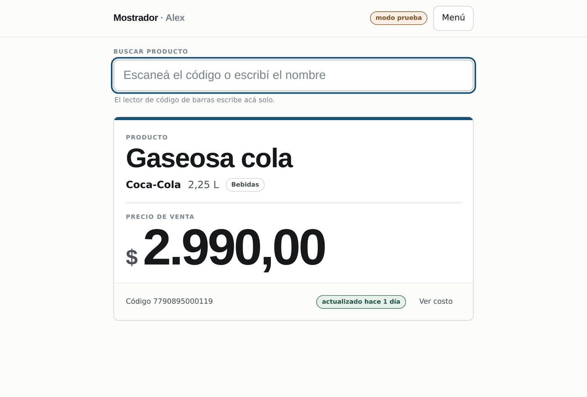
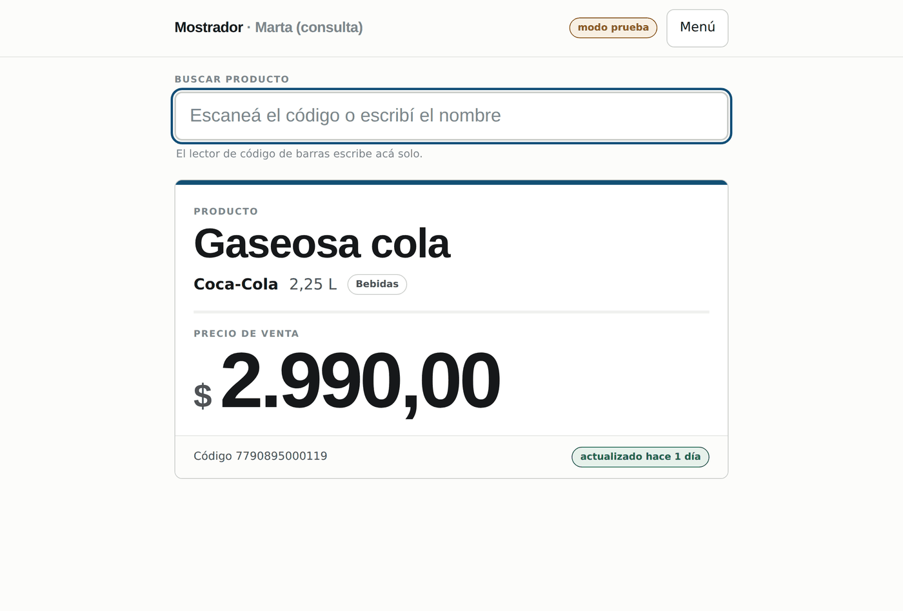
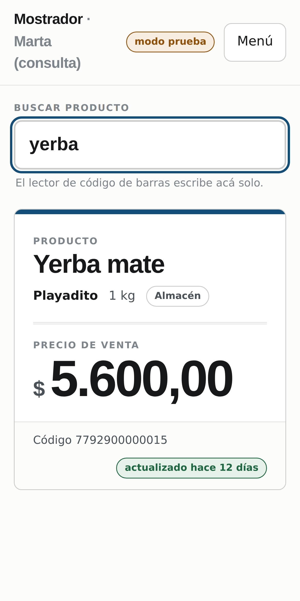

# Mostrador — consulta de precios para una despensa

App web para reemplazar la lista de precios en papel de un negocio de barrio.
Se busca escaneando el código de barras o escribiendo el nombre, y el precio
aparece **en letra grande**, legible desde el otro lado del mostrador.

El dueño ve costos y márgenes y carga productos. A quien le dé acceso, solo
puede consultar precios de venta — y eso no lo decide la interfaz, lo decide
la base de datos.



---

## Por qué existe

Es el sistema de precios de una despensa real, donde hasta ahora todo se hacía
a mano. De ahí salen la mayoría de las decisiones de diseño: el mostrador tiene
un celular viejo, el lector de código de barras es un teclado USB, y a veces se
corta internet.

---

## Cómo se ve

| Solo consulta — sin costos | En el celular del mostrador |
|---|---|
|  |  |

---

## Lo que hace

- **Un solo buscador** para las dos cosas: si lo que entra son solo dígitos y al
  menos seis, es un código de barras; si no, es un nombre.
- **Escaneo continuo.** Escaneás uno, aparece la ficha; escaneás otro y la
  pantalla se limpia sola y muestra el nuevo. Sin tocar nada.
- **Dos niveles de acceso.** El dueño ve costo y margen; el resto, solo el
  precio de venta.
- **Alta de accesos desde adentro de la app**, sin pasar por el panel de Supabase.
- **Historial de precios automático**, con un disparador en la base.
- **Importar y exportar Excel**, para la carga inicial de todo el catálogo y
  para copias de respaldo ocasionales.
- **Sigue consultando sin internet**: al entrar guarda una copia de la lista en
  el navegador. Escribir requiere conexión, a propósito.
- **Se instala en el celular** como aplicación (PWA).

---

## Cómo está armado

```
index.html → main.jsx → App.jsx → datos.js → ┬ datos-supabase.js → PostgreSQL
                                             └ datos-demo.js  (modo prueba)
                                                    ↑
                                     cache.js contesta si no hay red
```

`datos.js` es la pieza central: la interfaz nunca sabe con quién está hablando.
Eso permite que la app **arranque y se pueda probar sin base de datos**, y que
mudarla a otro backend sea cambiar un archivo.

| Archivo | Qué hace |
|---|---|
| `src/App.jsx` | Toda la interfaz: 13 componentes |
| `src/datos.js` | Elige el origen de datos y agrega el respaldo sin red |
| `src/datos-supabase.js` | Todo lo que habla con la base |
| `src/datos-demo.js` | 12 productos en memoria, para probar sin configurar nada |
| `src/cache.js` | La copia local para cuando se corta internet |
| `src/excel.js` | Importar y exportar, con los códigos forzados a texto |
| `supabase/esquema.sql` | Tablas, políticas de seguridad, historial y búsquedas |

**Tecnologías:** React 18, Vite 6, Supabase (PostgreSQL + Auth + RLS), ExcelJS,
vite-plugin-pwa. Sin framework de estilos: CSS propio.

---

## Las decisiones que vale la pena mirar

**El permiso vive en la base, no en la pantalla.** Quien solo consulta lee una
vista que literalmente no tiene la columna del costo. Si el filtro estuviera en
el JavaScript, el dato ya habría viajado al navegador y se vería abriendo las
herramientas del desarrollador.

**Las búsquedas son funciones de PostgreSQL, no filtros armados con texto.** La
primera versión concatenaba el texto del usuario dentro del filtro. Se cambió a
funciones `security definer` que reciben el texto como parámetro.

**El lector de código de barras es un teclado.** Escribe trece dígitos en
milisegundos. Sin una espera de 120 ms, cada dígito dispararía una búsqueda:
trece viajes al servidor y doce respuestas de "no está cargado".

**Las respuestas viejas se descartan.** Si se escanean dos productos seguidos,
la respuesta del primero puede llegar después de la del segundo. Cada búsqueda
lleva un número de orden y se descarta si ya salió otra más nueva.

**No se borran productos, se desactivan.** Borrar la fila se lleva puesto el
historial de precios, que es el dato que no se puede reconstruir.

---

## Probarlo sin configurar nada

```bash
npm install
npm run dev
```

Sin archivo `.env`, la app arranca en **modo prueba** con doce productos de
ejemplo:

| Cuenta | Contraseña | Qué ve |
|---|---|---|
| `alex@prueba.com` | `despensa` | Todo: costos, carga, accesos |
| `marta@prueba.com` | `despensa` | Solo el buscador y el precio de venta |

Para simular el lector, escribí `7790895000119` de corrido: aparece la ficha, la
casilla se vacía sola y la barra superior destella.

La puesta en marcha con Supabase y Vercel está paso a paso en **[LEEME.md](LEEME.md)**.

---

## Estado

Funciona de punta a punta y compila para producción. Todavía **no está en uso
diario en el negocio**: falta la carga inicial del catálogo.

Pendiente, en orden: aumento de precios por porcentaje sobre un rubro o
proveedor (la función SQL `aumentar_precios` ya está escrita, le falta la
pantalla), control de stock, y fotos de productos.

Fuera del alcance por ahora: cobrar, facturación electrónica y manejo de caja.

---

## Licencia

MIT. Ver [LICENSE](LICENSE).
